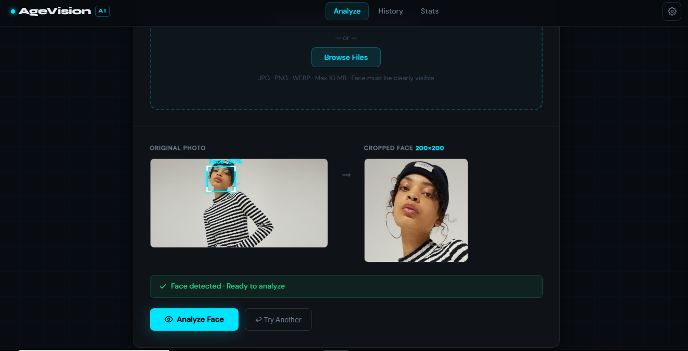
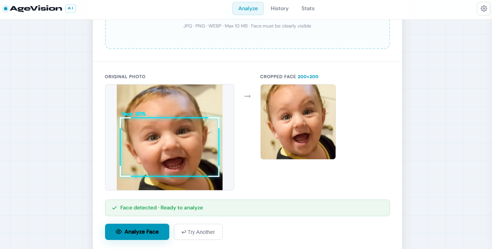
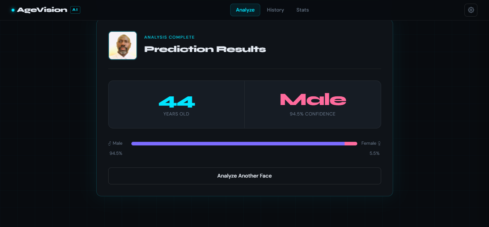
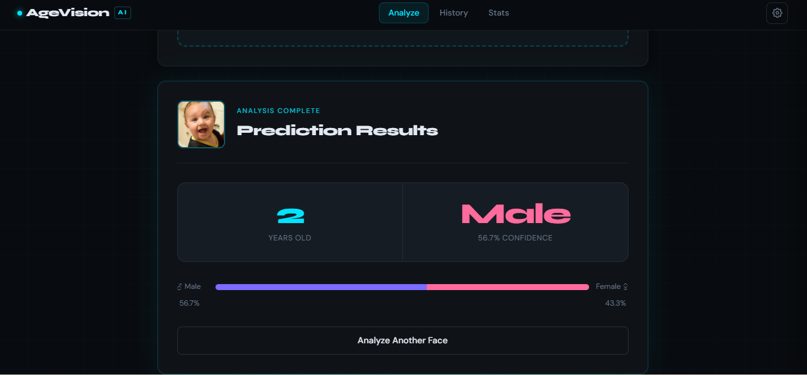
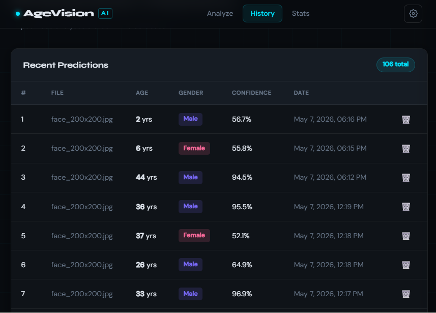
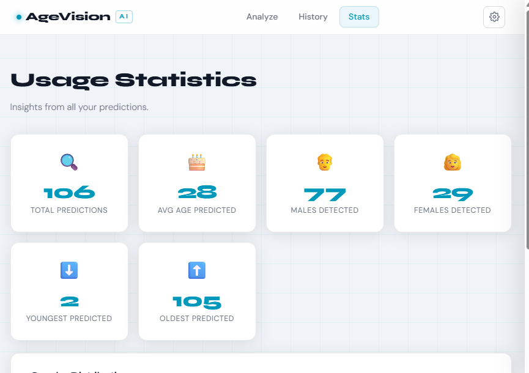

# AgeVision AI

> Predict a person's **age** and **gender** from a facial photo using deep learning.

A full-stack application with a MobileNetV2-based TensorFlow model on the backend and a Node.js + MySQL web interface on the frontend. Face detection and cropping happen entirely in the browser using **face-api.js**  only the clean, cropped 200×200 face is ever sent to the prediction server.

---

## Screenshots

| Dark Mode | Light Mode |
|-----------|------------|
| | |
| | |
| | |

---

## Features

  **Three input methods**  drag & drop, file browser, or live camera/selfie
  **In-browser face detection**  powered by face-api.js (TinyFaceDetector + SSD MobileNetV1)
  **Auto crop & resize**  detects the face, crops it with padding, resizes to exactly 200×200px
  **Error on no face**  rejects images where no face is detected
  **Age prediction**  regression model, typical error ±5–8 years
  **Gender prediction**  binary classification, typical accuracy 88–93%
  **Dark / Light mode**  persistent theme preference saved to localStorage
  **Fully responsive**  hamburger menu on mobile, adaptive layouts at 768px and 600px
  **History & Statistics**  all predictions saved to MySQL, viewable in the web UI
  **Environment config**  credentials managed via `.env`, never hardcoded

---

## Tech Stack

| Layer | Technology |
|-------|-----------|
| AI Model | TensorFlow / Keras · MobileNetV2 |
| Face Detection | face-api.js (browser-side) |
| Prediction API | Python · Flask |
| Web Server | Node.js · Express |
| Database | MySQL |
| Frontend | HTML · CSS · Vanilla JS |

---

## Project Structure

```
age-gender-prediction/
├── .gitignore
├── README.md
│
├── model/
│   ├── step1_prepare_csv.py        # Parse image filenames → train.csv / test.csv
│   ├── step2_train_model.py        # Train MobileNetV2 model (10 epochs)
│   ├── step3_test_model.py         # Evaluate model on test set or single image
│   └── step4_prediction_api.py    # Flask API server (port 5001)
│
└── interface/
    ├── .env                        # Your local config (never commit this)
    ├── .env.example                # Template — safe to commit
    ├── .gitignore
    ├── package.json
    ├── server.js                   # Express server (port 3000)
    ├── setup_database.sql          # MySQL schema setup
    ├── download_models.js          # Downloads face-api.js weights locally
    └── public/
        ├── index.html              # Main prediction page
        ├── history.html            # Prediction history
        ├── stats.html              # Usage statistics
        ├── css/
        │   └── style.css
        └── js/
            ├── theme.js            # Settings panel, dark/light mode, hamburger
            ├── face-detect.js      # Face detection & crop logic (face-api.js)
            ├── app.js              # Main page logic
            ├── history.js          # History page logic
            └── stats.js            # Stats page logic
```

---

## Prerequisites

| Requirement | Version |
|-------------|---------|
| Python | 3.8+ |
| Node.js | 16+ |
| MySQL | 8+ |
| NVIDIA GPU | Optional — CPU works, GPU is ~5–10× faster |

---

## Installation & Setup

### 1  Clone the repository

```bash
git clone https://github.com/Ekidu-William/age-gender-prediction.git
cd age-gender-prediction
```

### 2  Install Python dependencies

```bash
pip install tensorflow pandas numpy scikit-learn matplotlib pillow flask flask-cors
```

> **GPU users:** replace `tensorflow` with `tensorflow-gpu` for significantly faster training.

### 3  Install Node.js dependencies

```bash
cd interface
npm install
```

### 4  Download face detection model weights

This downloads ~6 MB of weight files into `public/models/`. Only needs to be done once.

```bash
node download_models.js
```

### 5  Configure environment variables

```bash
cp .env.example .env
```

Then open `.env` and fill in your MySQL credentials:

```env
PORT=3000
PYTHON_API_URL=http://localhost:5001

DB_HOST=localhost
DB_USER=your_mysql_username
DB_PASSWORD=your_mysql_password
DB_NAME=age_gender_db
DB_PORT=3306
```

### 6  Set up the MySQL database

```bash
mysql -u root -p < setup_database.sql
```

Or paste the contents of `setup_database.sql` into MySQL Workbench / phpMyAdmin and execute.

---

## Training the Model

### Step 1  Prepare CSVs from your image dataset

Your images must follow the UTKFace naming convention:

```
[age]_[gender]_[race]_[datetime].jpg
```

- `age` — integer 0–116
- `gender` — `0` = Male, `1` = Female
- `race` — `0` = White, `1` = Black, `2` = Asian, `3` = Indian, `4` = Other
- `datetime` — format `yyyyMMddHHmmssSSS`

Run:

```bash
cd model
python step1_prepare_csv.py --images_dir /path/to/your/images
```

This creates `train.csv` (80%) and `test.csv` (20%) with an even gender split.

### Step 2  Train the model

```bash
python step2_train_model.py
```

Training runs for 10 epochs. A progress graph is saved to `training_history.png` and the best model weights are saved to `age_gender_model.h5`.

| Hardware | Estimated Time |
|----------|---------------|
| CPU | 2–4 hours |
| GPU (NVIDIA) | 20–40 minutes |

> To reduce memory usage, lower `BATCH_SIZE` from `32` to `16` inside `step2_train_model.py`.

### Step 3  Evaluate the model (optional)

```bash
# Test on a single image
python step3_test_model.py --image /path/to/face.jpg

# Full evaluation on test set
python step3_test_model.py --evaluate
```

**Expected results on 24 000-image dataset:**

| Metric | Typical Value |
|--------|--------------|
| Gender accuracy | 88–93% |
| Age MAE | ±5–8 years |
| Age within 10 years | ~85% |

---

## Running the Application

Two servers must run simultaneously  open **two terminal windows**.

**Terminal 1  Python prediction API:**

```bash
cd model
python step4_prediction_api.py
```

```
 Model loaded successfully!
 Prediction API starting on http://localhost:5001
```

**Terminal 2  Node.js web interface:**

```bash
cd interface
node server.js
```

```
 Connected to MySQL database
 Web interface running at http://localhost:3000
```

Open **http://localhost:3000** in your browser.

---

## Usage

1. Open the app at `http://localhost:3000`
2. Choose an input method:
   - **Upload / Drop** — drag an image onto the zone or click Browse
   - **Camera / Selfie** — click *Open Camera*, position your face, tap capture
3. The browser detects your face, draws a bounding box, and shows the 200×200 crop
4. If no face is found, an error is shown — try a clearer, well-lit photo
5. Click **Analyze Face** to send the crop to the model
6. View predicted age, gender, and confidence score
7. Browse past predictions at `/history` and aggregate stats at `/stats`

### Settings

Click the **⚙ gear icon** in the top-right navbar to open the Settings panel:

- **Dark mode** (default)  high-contrast dark theme
- **Light mode**  clean light theme

The preference is saved automatically and persists across all pages and sessions.

---

## API Reference

The Flask prediction API exposes these endpoints:

| Method | Endpoint | Description |
|--------|----------|-------------|
| `GET` | `/health` | Check if API is running and model is loaded |
| `POST` | `/predict` | Submit an image, receive age + gender prediction |

**POST `/predict`  request:**

```
Content-Type: multipart/form-data
Body: image (file)
```

**POST `/predict`  response:**

```json
{
  "age": 27,
  "gender": "Female",
  "gender_confidence": 91.4,
  "raw_age_normalized": 0.233,
  "raw_gender_probability": 0.914
}
```

---

## Environment Variables

| Variable | Default | Description |
|----------|---------|-------------|
| `PORT` | `3000` | Node.js server port |
| `PYTHON_API_URL` | `http://localhost:5001` | URL of the Flask prediction API |
| `DB_HOST` | `localhost` | MySQL host |
| `DB_USER` | `root` | MySQL username |
| `DB_PASSWORD` | *(empty)* | MySQL password |
| `DB_NAME` | `age_gender_db` | MySQL database name |
| `DB_PORT` | `3306` | MySQL port |

---

## Troubleshooting

| Problem | Solution |
|---------|----------|
| `No module named tensorflow` | `pip install tensorflow` |
| `age_gender_model.h5 not found` | Run `step2_train_model.py` first |
| Face detection overlay error | Run `node download_models.js` in `interface/` |
| `Connection refused` on predict | Start `step4_prediction_api.py` |
| History page shows error | Check MySQL is running; verify `.env` credentials |
| `Out of memory` during training | Set `BATCH_SIZE = 16` in `step2_train_model.py` |
| Camera not working | Browsers require HTTPS for camera on non-localhost origins |
| Images not parsed | Verify filename format: `25_0_2_20010301120000000.jpg` |

---

## Dataset

This project was built and tested with the [UTKFace dataset](https://susanqq.github.io/UTKFace/) (~24 000 images). The dataset is not included in this repository. Download it separately and point `step1_prepare_csv.py` at your local copy.

---

## License

This project is licensed under the [MIT License](LICENSE).

---

## Acknowledgements

- [UTKFace Dataset](https://susanqq.github.io/UTKFace/) — training data
- [face-api.js](https://github.com/justadudewhohacks/face-api.js) — in-browser face detection
- [MobileNetV2](https://arxiv.org/abs/1801.04381) — backbone architecture
- [TensorFlow / Keras](https://www.tensorflow.org/) — model training framework
